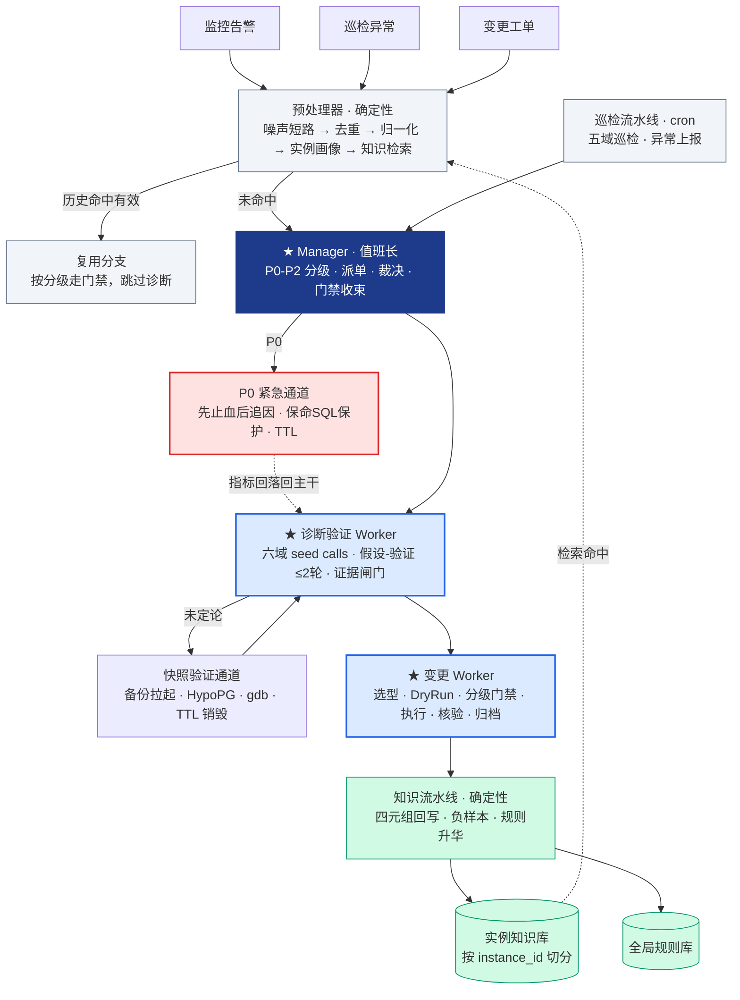
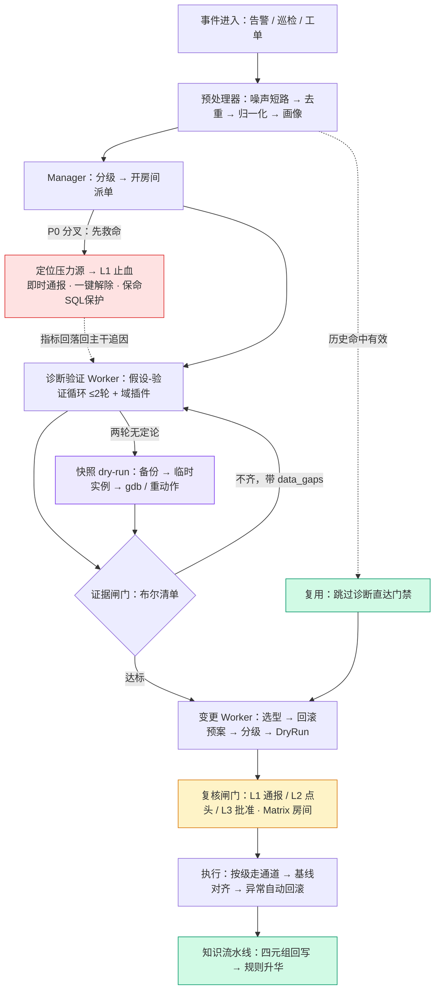
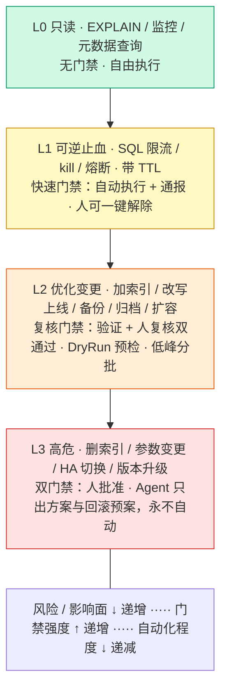

# ZeroDBA 方案设计（参赛版）

> 版本：v0.2（2026-08-10）· 赛道：GOAI Agent Infra · 方向一 零人工运维
> 团队：高校学生团队（成员具数据库运维实习经历）
> 承继关系：本文档在内部设想稿《无人值守的数据库运维Agent（zero-SreAgent）》（v1）基础上改造而成，差异对照见附录 A；内网基建依赖的公网映射细节见《基建映射改造.md》

## 一、背景与问题

数据库运维长期是"人盯着才转"的工作：告警来了要人查，慢 SQL 要人诊断，索引要不要加要人判断，优化完还要人复核。夜间告警、节假日值守、重复排查同类问题，构成 DBA 的主要负担。

大模型与 Agent 技术让"把专家经验交给 Agent 自动执行"第一次具备工程可行性。但数据库是所有运维领域中**最不敢自动化**的：有状态、变更难回滚、根因链深。全场评委的直觉都是"不敢让 AI 动生产数据库"。

**ZeroDBA 的命题**：用「验证通道 + 分级门禁 + JIT 权限」三重保险回答"敢"。构建无人值守的数据库运维 Agent 团队——以告警、巡检、工单三类任务为触发，Agent 自动完成「感知 → 诊断 → 验证 → 决策 → 执行 → 沉淀」闭环；人只在对应风险等级的门禁处做"点头"动作。

**技能基础**：团队成员在数据库运维实习中接触并参考了企业级分层技能体系（问题分析、稳定性巡检、容量管理、日常巡检、复制诊断、知识问答），含六域诊断引擎（监控/SQL/会话/事件/变更/统计）、快速路径、冲突消解规则与 evals 评测用例。本方案面向公网环境重构，将其从"人调用的工具"升级为"Agent 自主编排的能力底座"。

## 二、创新点与亮点

### 2.1 确定性内核 + 判断点薄 Agent

所有可机械判定的操作强制落在确定性代码上，LLM 仅在真正需要判断力的节点介入。收益：幻觉暴露面最小化、确定性链路可复现可测试、token 成本可控。"能机械判定的不打扰 LLM"是全系统硬规则。

**架构推论**：按此原则裁剪 Agent 数量——8 个设想岗位中 5 个本质是确定性流水线，不应 Agent 化。最终形态为 **3 Agent + 2 流水线**（见 4.4）。

### 2.2 虚拟 DBA 团队：岗位按阶段切，不按场景切

岗位按无人值守闭环的阶段设（编排/诊断验证/变更执行），不按业务场景设。无论进来的是慢 SQL、CPU 打满、磁盘将满还是备份失效，走的都是同一条流水线，域的差异只体现在诊断时加载哪套技能与规则。**系统能力边界由技能库覆盖面决定，不由 Agent 数量决定**——新增运维域只补技能、补规则、补证据口径，编排、门禁、交接契约、沉淀机制完全不动。

### 2.3 实例级自进化知识库

每个实例拥有独立知识空间，每次处置以「问题 → 根因 → 动作 → 效果」四元组回写。新告警进入先检索历史：命中且历史动作经核验有效则直接复用，跳过诊断链路——"值守越多系统越聪明"的正反馈飞轮。跨实例通用经验经复核上升为全局规则库，形成"实例级记忆 + 全局级规则"两级沉淀。复核被拒条目写入负样本库，防止同类误判再次放行。

**冷启动**：历史变更工单（含审批结论与执行效果）是四元组的现成来源。

### 2.4 快照验证通道：零失真的真实环境验证 ★

不在沙箱里"重建近似环境"（重建环境的数据分布、统计、参数、内核版本很难对齐，失真无法根除），而是**直接打快照**：对目标实例做物理备份，从备份拉起临时验证实例，所有 dry-run 动作在"生产的副本"上执行。数据、统计、参数、内核版本与生产完全一致，保真度问题从根上消失；生产实例全程零写入、零 attach；验证结束按 TTL 自动销毁回收。

公网实现：pg_basebackup / ECS 磁盘快照恢复到临时验证 ECS；What-If 索引验证用 HypoPG 扩展（虚拟索引 + EXPLAIN 成本比对，不真实建索引）；流量回放用 CloudBench 或自录流量；到期由验证流水线自动释放实例。

"先在生产的副本上跑一遍，再动生产"由此成为所有高风险动作的统一前置。

### 2.5 三级验证 + 分级门禁的安全执行体系

三级验证（机械验证 → 证据链验证 → 人工复核闸门）确保每条建议有量化证据支撑；操作分级（L0 只读 → L1 可逆止血 → L2 受控变更 → L3 人批准）加白名单、TTL、熔断、全审计，让高危操作永远在人掌控之下。"无人值守不等于无人管"由此成为可工程化的承诺。

### 2.6 假设-验证循环诊断范式

区别于"一次性扇出所有检查项"，采用假设-验证循环（上限 2 轮、目标求伪）：每轮提出假设 → 采集针对性证据 → 验证或推翻。避免扇出噪声，接近资深 DBA 的思维方式，同时控制诊断轮次与资源消耗。第一轮采集强制包含变更时间线对齐——近期变更是线上故障第一嫌疑，先排除再谈别的。

### 2.7 量化护栏：诊断循环的有界性 ★

借鉴开源 AI SRE 框架（OpenSRE）的护栏实践，诊断循环设全套量化护栏：

| 护栏 | 常量 | 作用 |
|---|---|---|
| 工具集上限 | ≤12 个/轮（按六域装载） | 防工具描述撑爆上下文 |
| 循环上限 | 8 轮 | 最坏运行时间有界 |
| 停滞熔断 | 连续 2 轮无新证据 → nudge → 强制带 data_gaps 出结论 | 防死循环烧 token |
| 重复调用缓存 | 相同调用回放缓存并告知 LLM | 防重复浪费 |
| 上下文预算 | 低价值证据按价值驱逐/截断；大产物落 MinIO 只传指针 | 防上下文爆炸 |
| 噪声短路 | 告警入场一次判定，噪声直接短路不跑任何工具 | 降噪第一闸 |
| LLM 失败降级 | 保留已采集证据，降级转人工，不崩溃 | 证据不丢 |

### 2.8 结构化证据结论

诊断结论强制结构化：根因、因果链、**已验证声明 / 未验证声明分开列**、建议动作、置信度评分。中间分析过程不随结论输出，留在证据档案备查。

## 三、场景与价值

| 场景 | 过往模式 | ZeroDBA 模式 |
|---|---|---|
| P0 重大故障（CPU 打满/连接暴涨） | 人肉定位 top SQL、手动限流，止血动辄几十分钟 | 分钟级自动止血：检索知识库 → 定位压力源（含保命 SQL 保护）→ 自动执行可逆止血（SQL 限流/kill/熔断，带 TTL）→ 止血后追根因 |
| 慢 SQL / 性能告警 | 人工看告警 → 拉 SQL → 看计划 → 赌效果 | 六域诊断 + 假设验证 → HypoPG What-If 出量化证据 → 人复核 → 受控执行 → 效果核验回写 |
| 无建议疑难 SQL | 依赖专家 gdb 调试 | 快照拉起验证实例，dry-run + gdb 抓栈定位，生产零影响 |
| 日常变更工单（加索引/改参数） | DBA 凭经验估影响面后审批 | **审批助手**：自动预检 + What-If 验证 + 历史案例匹配，产出证据包；审批决定永远是人，但审批前的功课 Agent 做完 |
| 每日稳定性巡检 | 人工触发、人工看报告 | 定时自主巡检容量/事件域，异常自动升级为诊断任务 |
| 备份失效 | 事后发现，恢复能力从未实测 | 备份异常自动补跑，定期真实拉起校验有效性 |
| 重复诊断浪费 | 同类问题反复排查 | 知识库命中复用 + schema 指纹追踪，未变化不重跑链路 |

**预期价值**：告警响应从"人级"降到"分钟级"；专家经验资产化为可执行规则库；从建议到行动（P0 先自动止血，验证通过的优化受控执行）；运维风险可控（分级门禁 + 可回滚 + 全审计）。

## 四、方案设计

### 4.1 运行时底座：AgentTeams

| AgentTeams 特性 | 在 ZeroDBA 中的用途 |
|---|---|
| Manager-Workers 架构 | Manager 承接任务入口，统一编排 Worker，Agent 管理 Agent |
| Matrix 房间 + HITL | 每个任务开一个房间，人与 Agent 同室，复核闸门天然落在 IM 里，"点头"零成本 |
| MinIO 共享文件系统 | EXPLAIN、诊断明细等大产物走文件交换，Agent 间只传指针，token 消耗大幅下降 |
| Higress 网关凭据隔离 | 真实凭据收敛在网关，Worker 只持消费者令牌 |
| K8s 原生声明式资源 | Worker/Team 以 CRD 声明，灰度、扩缩容、回滚都是标准操作 |
| 集成 AgentLoop | 全链路推理轨迹观测与审计 |

### 4.2 数据库双角色声明

| 角色 | 选型 | 用途 |
|---|---|---|
| 被运维对象 | **ECS 自建 PostgreSQL 三节点** | 故障发生、诊断、止血、变更的主场景 |
| Agent 数据层 | PolarDB for PostgreSQL + pgvector | 实例画像、四元组经验、向量检索、规则库、审计 |

选 PG 的决策依据：HypoPG 虚拟索引扩展可无损继承 What-If 验证能力（MySQL 生态无等价物）；与数据层技术栈统一，一套技能两边用。

### 4.3 三类任务入口

| 入口 | 驱动方式 | Agent 角色 | 门禁特点 |
|---|---|---|---|
| 告警 | 问题驱动（CMS/DAS 异常事件） | Agent 主导发现与处置 | P0 可先执行后报备（L1 限时可逆） |
| 巡检 | 主动发现（cron 流水线） | 异常自动升级为诊断任务 | 同告警链路 |
| 工单 | 意图驱动（日常变更申请） | 审批助手：预检/验证/影响面评估产出证据包 | 审批决定永远是人；Matrix 房间即工单介质，演进留 MCP 适配层 |

三类入口进同一条主干流水线——任务输入面完整覆盖赛道要求（告警/工单/日志类事件）。

### 4.4 架构：3 Agent + 2 流水线 + 工具带

**运行时选型**：统一 OpenClaw 运行时，确定性体现在 Skill 内（脚本工具），不依赖运行时切换。

**设计推论**（vs 设想稿 8 岗位）：感知、巡检、验证核对、决策选型、执行动作、知识回写中的确定性部分全部下沉为流水线或 Skill 内脚本；只有编排裁决、诊断判断、变更裁量保留为 Agent。协调跳从 7 降到 2，token 与故障面同步下降——这本身就是"确定性内核"原则的最佳自证。

### 4.5 任务拆解：主干 + 域插件

主干（所有事件共用）：入口 → 预处理（噪声/去重/画像/知识检索）→ 分级派单 →【P0 分叉：先止血后追因】→ 诊断（假设-验证）→ 证据闸门 → 决策选型 → 门禁 → 执行 → 核验 → 回写。

域插件（新增域只加一行，主干不改）：

| 运维域 | 诊断插件 | 证据口径 | 动作集（分级） |
|---|---|---|---|
| 性能与慢 SQL | SQL 模板聚合、执行计划基线比对、统计新鲜度核查 | HypoPG 前后 cost 比对、改写前后双份 EXPLAIN | SQL 限流（L1）；加索引/改写上线（L2） |
| 突发故障（CPU/连接/锁） | 多域协同采集 + 最小故障域收敛 + 变更时间线对齐 | 压力源因果证据、时间线重合度 | kill/限流/熔断（L1）；参数调整/HA 切换（L3） |
| 容量与存储 | 增长趋势外推、到顶时间预测、自增溢出核查 | 增长曲线置信区间、空间构成拆解 | 扩容/归档（L2） |
| 可恢复性 | 备份成功率、有效性、恢复点核查 | 真实拉起实测结果、RPO/RTO 证据 | 补跑备份/调整策略（L2） |
| 参数治理 | 基线偏离扫描、workload 匹配度评估 | 快照实例上验证调整后行为 | 参数调整（L3） |
| 变更防御 | 告警窗口内变更对齐、影响面回溯 | 变更时间线与指标拐点重合度 | 止血（L1）；回滚建议（L3） |
| 知识问答 | 错误码、组件排查、值班问题检索 | 知识库来源可追溯 | 直接作答（L0） |

拆解硬规则：verdict 明确即跳过 LLM；每个子任务单一职责（产物即证据）；任何域不能绕过验证与门禁。

### 4.6 上下文传递

- **权威交接契约**：结构化 JSON 文件交接（诊断结论含 validated/non-validated claims + 置信度），IM 消息只传指针 + 摘要
- **MinIO 大产物**：EXPLAIN、诊断明细落 MinIO，按需读取最小切片，禁止全量透传
- **上下文隔离**：每任务独立工作目录（instance_id + 事件 ID），结束归档
- **留痕**：所有 Agent 介入动作写统一 trace，隐形调用在收束时被拦截
- **脱敏边界 ★**：一切进 LLM 上下文的数据（SQL 字面量、表名、日志）先过脱敏层——数据库场景的数据安全红线

### 4.7 结果验证

每条结论过同一套闸门，只有证据口径按域不同：

1. **机械验证**：确定性规则给出 verdict（recommended / not_improved / needs_manual_review），带量化依据
2. **证据链验证**：索引建议必须有 HypoPG 前后 cost 对比；改写建议必须有双份真实 EXPLAIN；gdb 根因必须在验证实例取得；故障类必须有压力源因果链与变更时间线对齐
3. **人工复核闸门**：所有 Agent 产出默认 pending_review，复核通过前禁止执行；已验证确有提升的加索引可 auto_approved
4. **落地后核验**：指纹追踪 + 指标基线自动核验实际收益，无效果回流诊断

### 4.8 执行与安全护栏

**操作分级**：

| 分级 | 操作类型 | 执行方式 |
|---|---|---|
| L0 只读 | EXPLAIN、监控、会话/元数据查询 | 自由执行 |
| L1 可逆止血 | SQL 限流、kill 会话、熔断 | P0 可先执行后报备；必须可逆、限时（TTL 自动解除）、即时通报 |
| L2 优化变更 | 加索引、经验证的改写上线、备份策略、归档、扩容 | 验证 + 人复核双通过后，DryRun 预检，低峰执行 |
| L3 高危 | 删索引、参数变更、HA 切换、版本升级 | 永远人批准；Agent 只出方案与回滚预案 |

**护栏**：白名单制（白名单外在工具层直接拒绝）；无证据不执行；可回滚优先（止血带 TTL，DDL 附回滚预案，回滚失败升级人工并冻结该实例自动执行）；限频与配额（防执行本身成为压力源）；熔断降级（连续复核拒绝 → 暂停自动放行）；全程审计（云助手执行记录 + ActionTrail + Matrix 消息，RoleSessionName 关联事件号）。

**执行通道**：L1 走 DAS 止血 API（限流/kill，不依赖主机 Agent 存活度，TTL 由定时撤销任务模拟）；L2/L3 走云助手（DryRun 预检 → Username 数据库属主最小权限 → ClientToken 幂等）；门禁走 Matrix 房间（L1 通报可一键解除 / L2 点头 / L3 批准）。权限双层 JIT：Higress allowedConsumers 管"哪个 Agent 能调哪个工具"，STS AssumeRole 管"这次调用持什么权限、何时过期"。

**P0 紧急通道**：不等完整诊断——基于实例画像快速定位压力源（top SQL/阻塞会话/近期变更），比对保命 SQL 白名单后自动执行 L1 止血，Matrix 通报可一键解除；指标回落后进常规链路追根因；全程回写知识库。

### 4.9 异常分支

| 异常 | 处理 |
|---|---|
| 取数通道失效 | 自动重试 → 降级人工工单，明确标注数据缺失，禁止基于缺失数据下结论 |
| 验证实例拉起失败 | 禁止在生产 attach/试跑，降级人工，标注"验证通道不可用" |
| 统计陈旧 | 判定后建议 ANALYZE，不重复诊断、不进快照通道 |
| LLM 低置信结论 | 强制转人工，不允许自动放行 |
| LLM 调用失败 | 降级为部分状态，已采集证据保留，不崩溃 |
| 复核被拒 | 回流人工，拒绝原因写入负样本库 |
| P0 止血未生效 | 立即升级人工，保留现有止血动作，禁止盲目升级风险 |
| 执行失败/执行后指标异常 | 按预案自动回滚，回滚失败升级人工并冻结该实例 |
| Worker 超时/崩溃 | Manager 心跳监控，超时重派一次，二次失败升级人工 |

### 4.10 安全边界

- **诊断只读、执行门禁**：诊断链路生产只读；执行链路分离，限白名单内分级门禁
- **凭据隔离**：真实凭据收敛在 Higress 网关 + STS 临时凭证，Worker 只持工牌；日志不打明文密码
- **写库唯一例外**：仅备份拉起的临时验证实例（物理隔离、TTL 自动销毁）；生产默认 dry-run 零写库
- **生产禁 attach**：gdb 只允许在验证实例，边界在工具白名单层强制执行
- **LLM 前脱敏**：所有进 LLM 上下文的数据先脱敏
- **人机同室**：Matrix 房间全程可见可插话，没有黑箱

### 4.11 风险控制

- 宁可漏配不可误配：规则复用与语义匹配从严，拿不准转人工
- 执行灰度纪律：L1 → L2 分级开放（L3 永不自动），先影子运行（只产出不落地）对齐后再放量
- 规则沉淀纪律：新规则必须带结构化动作 + 证据链，经冲突检测与人工复核准入；错误规则一键回滚可追溯
- 删索引从严：全维度确认未使用 + 人工复核，DROP INDEX 属 L3 永不自动

## 五、Skill 与工具集成

### 5.1 官方云 Skills

| Skill | 用途 | 挂载 |
|---|---|---|
| alibabacloud-das-agent | 自然语言数据库诊断（结构化 API 查不出时的兜底大脑） | 诊断验证 Worker |
| alibabacloud-ecs-troubleshoot-skills | ECS 主机层排查（网络/磁盘/夯机）+ 安全检测 | 诊断验证 Worker |
| alibabacloud-cms-manage | 云监控告警管理 | Manager |
| alibabacloud-find-skills | 技能发现（Agent 自搜索安装所需技能） | Manager |

### 5.2 自研 Skills（承继团队技能资产，公网化改造）

| Skill | 用途 | 输入/输出 | 安全边界 |
|---|---|---|---|
| db-alert-correlate | 多源告警聚合降噪 + 噪声短路 | 原始告警流 → 结构化工单 | 只读 |
| db-six-domain-diagnose | 六域诊断引擎（seed calls + 假设验证） | 工单上下文 → domain_finding | 只读 |
| db-hypo-index-validate | HypoPG What-If 索引验证 | SQL + 候选索引 → cost 对比证据 | 仅验证实例 |
| db-snapshot-verify | 备份拉起验证实例 + TTL 回收 | 实例 ID → 验证实例句柄 | 生产零写入 |
| db-hemostat | L1 止血（DAS 限流/kill + TTL 撤销） | 压力源证据 → 止血动作 + 通报 | 白名单 + 可逆 |
| db-jit-grant | Higress + STS 双层 JIT 授权回收 | 动作分级 → 限时凭证 | 到期自动失效 |
| db-change-risk-grade | 变更风险分级（锁范围/影响面/可逆性） | 动作定义 → L0-L3 | 纯规则 |
| db-knowledge-writeback | 四元组回写 + 负样本 + 规则升华 | 处置记录 → 知识库 | 仅数据层写 |

每个 Skill 按赛道要求补齐 9 字段（名称/用途/输入输出/调用条件/依赖工具/失败处理/安全边界/复用价值/与协同流程关系），结构对齐官方 Skill 范式（SKILL.md + references/ + evals/）。

### 5.3 MCP 与工具集成

- 阿里云 OpenAPI / DAS API / aliyun CLI 经 Higress 网关统一托管（MCP Server 托管 + 凭证注入）
- 数据库直连仅两种形态：生产只读受控通道（Username 最小权限）、验证实例通道（唯一写例外）
- 对无 MCP 的内部系统给等价集成契约（参数 Schema/幂等/审计/降级），后续迁移仅协议适配

### 5.4 可观测

AgentTeams 集成 AgentLoop 覆盖 Skill 调用、MCP 工具、RAG 检索、LLM 推理全链路轨迹；数据库指标/日志走 CMS + SLS；处置审计走 ActionTrail + Matrix 消息。

## 六、可行性与落地计划

### 6.1 可行性

1. **方法论已验证**：六域诊断引擎、分级门禁、知识沉淀机制在团队既有技能资产中落地过，参赛版是"换基建不换方法论"
2. **基建映射完成**：17 项内网依赖全部映射为阿里云公网能力，逐项有降级路径（详见《基建映射改造.md》）
3. **底座已就绪**：AgentTeams v1.2.0 本地环境运行正常（Manager 在线、Dashboard 健康）
4. **待验证项已收敛**：DAS 自建库生效性等 5 项阻塞项清单明确，有对应降级方案

### 6.2 落地节奏（对齐赛程）

| 阶段 | 时间 | 目标 |
|---|---|---|
| 初赛 | 8/16 前 | 方案设计 + PPT + 简介；AgentTeams 环境就绪 |
| 复赛 P1 | 8/25-8/31 | ECS PG 三节点部署；Manager 接告警；预处理 + 分级派单链路 |
| 复赛 P2 | 9/1-9/3 | 诊断验证 Worker（六域 + HypoPG）；变更 Worker（门禁 + 云助手执行）；Demo 场景跑通 |
| 决赛 | 9/22 | 知识飞轮回填历史工单；灰度演练；现场 Demo |

### 6.3 度量口径（Demo 友好）

- L1 止血路径自动化率；P0 止血时长（目标 ≤5 分钟）
- 巡检异常自动升级率；告警去重合并率
- 证据包采纳率（工单场景）；复核通过率（目标 ≥90%）
- 知识库命中率；单告警 token 成本

## 附录 A：与设想稿（v1）的差异对照

| 项 | v1 设想稿 | v2 参赛版 | 原因 |
|---|---|---|---|
| Agent 数量 | 8 岗位 | 3 Agent + 2 流水线 | 确定性内核原则裁剪；协调跳 7→2 |
| 感知 Worker | 独立 Agent | 下沉为 Manager 的确定性预处理器 | 本质是 API 调用序列 |
| 验证 Worker | 独立 Agent | 合并进诊断验证 Worker（证据闸门内置） | 证据核对布尔清单化后是确定性 |
| 决策+执行 Worker | 两个 Agent | 合并为变更 Worker | 权限隔离由 STS JIT 实现，不靠组织拆分 |
| 知识 Worker | 常驻 Agent | 知识流水线（收尾钩子 + 低频后台任务） | 机械回写 + 低频升华不需要常驻 |
| 任务入口 | 告警 + 巡检 + 人工报障 | 告警 + 巡检 + **工单（审批助手）** | 补齐赛道任务输入面 + 日常变更场景 |
| 验证通道 | 平台快照拉起 | 备份拉起临时 ECS + HypoPG + CloudBench | 公网无平台快照能力；自建场景更灵活 |
| TDDL 域 | 六域之一 | 删除（预留中间件域占位） | 公网场景不存在 |
| 量化护栏 | 无 | 2.7 节全套常量护栏 | 借鉴 OpenSRE |
| 脱敏边界 | 无显式声明 | LLM 前脱敏硬边界 | 数据库场景数据安全必答 |
